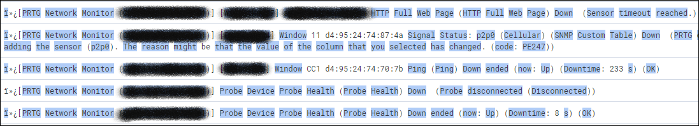
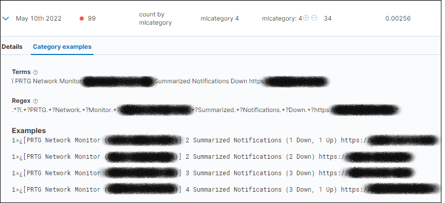
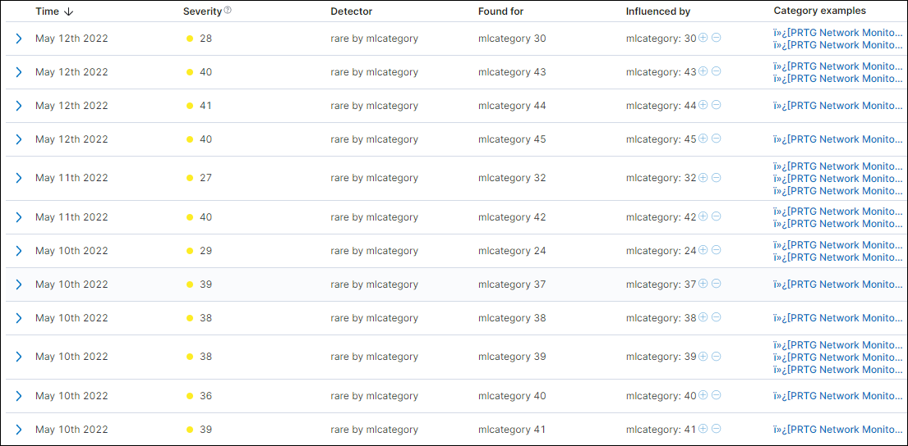
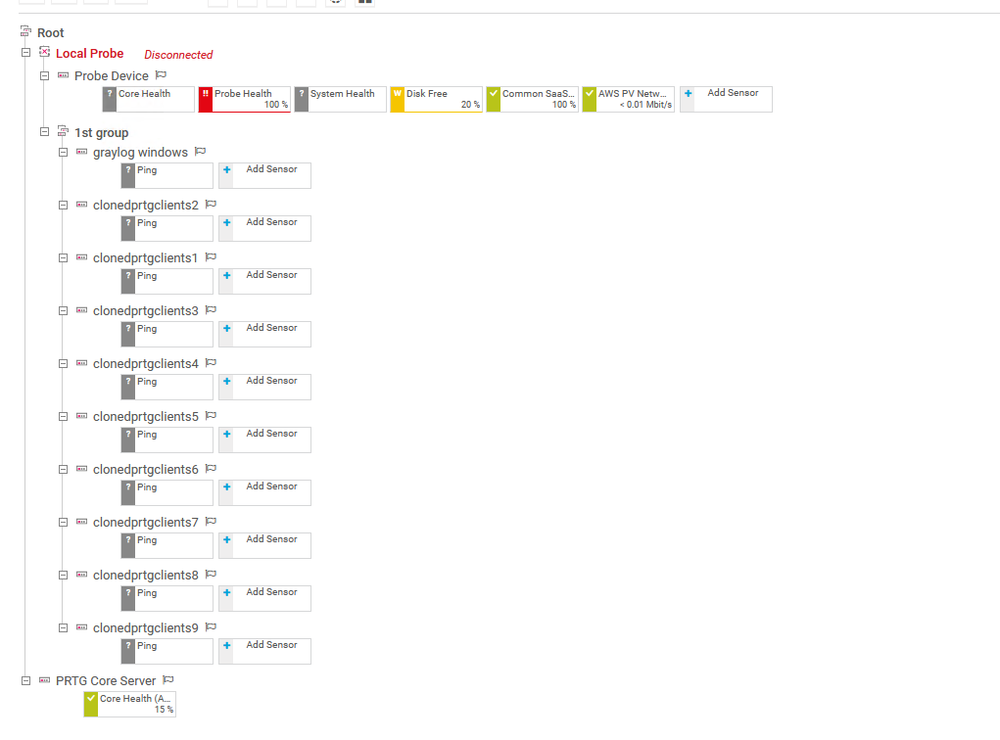
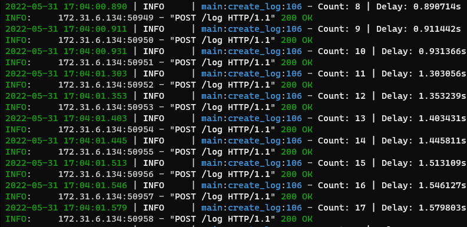
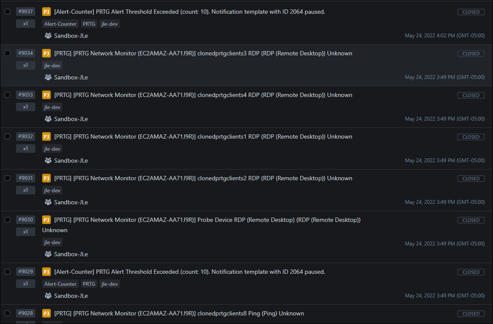

---

<!--_class: lead invert-->

# **Team Introductions**

---

# **The Brainstorming Process**

Project ideas:
- AI analysis of difficulty of customers
- AI analysis of PRTG Alerts
- AI analysis of time spent trends

---

# **The Problem**
Automated alerts are handled by a group of new, L1 engineers.
The sheer scale of alerting topics is daunting and too much to learn or research as applicable.

A series of seemingly disjointed alerts create a correlation in the mind of a Sr. engineer, but are easy to overlook for a newer engineer.

Example: An alert about a UPS on battery backup comes in. An hour later the site goes offline. A Sr. engineer will identify a likely power failure, but a new L1 engineer does not necessarily note the correlation.

---

# **Our Solution (Version 1.0)**

Add AI behind identifying and correlating alerts to crunch data and identify correlations.
- Reduce L1 burden
- Reduce manual training 
- Expedite escalation of important events
- Bridge the gap between teams

---

# **The Journey to the Solution**

--- 

# **Wait...This Does Not Work**

Deploying an AI solution that can work off prtg message data is harder to setup than originally thought. 

* Noisy syslog messages
* Not enough **useful** data
* Noisy results

<!--
- unparsed syslog messages
- trouble filtering useful data
- not enough data
- garbage in, garbage out
-->

---

<!--
- top-left: unaggregatable data
- top-right: noisy syslog message, emphasize repeated words
- bottom-left: bad data
- bottom-right: noisy results
-->

---

# **Time for Reflection**

---

# **Our Solution (Version 2.0)** 

---

# **Overview of Solution**

Description

---

<!--
_backgroundColor: #1e1e1e
-->

# **Let's Look Under the Hood**

<!--
- 
- As a result...
-->

---

# **Results**

 

<!--
- prevents mass, unnecessary alerts and ticket creation
- proactive, automatic approach
- custom, disgestable alert to escalate
- top-left: example error sending mass alerts
- bottom-left: api counter alerts
- right: custom opsgenie alert, as oppose to mass alerts
-->

---

# **Future Road Map**

