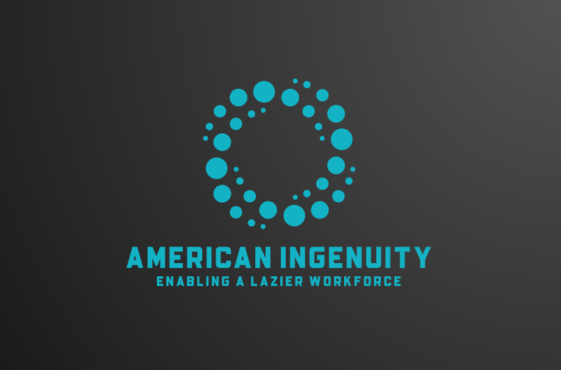
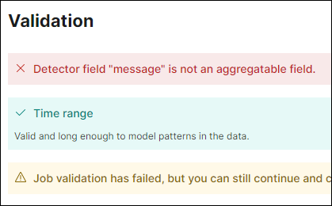

---

<!--_class: lead invert-->

# **Team Introductions**
<!-- 
Presenter: SUMMER MARKLEY
Highlights: How we can we came about our name and logo 
Estimated Time:  2 mins
-->

---

# **The Brainstorming Process**
<!-- 
Presenter:        JONNY LE
Highlights:       Discuss how we as a team stepped through our initial ideas and formulated our final solution
Estimated Time:   2 mins
-->
Project ideas:
- AI analysis of PRTG Alerts
- AI analysis of Opsgenie
- AI analysis of time spent trends
- AI analysis of difficulty of customers

<!--
- buzzword/interest in AI
- find its application in all tools and workflows
-->

---
<!-- 
Presenter:        GABRIELLE WOODS
Highlights:       See Gab's index cards
Estimated Time:   5 mins
-->
# **The Problem**
Automated alerts are handled by a group of new, L1 engineers.
The sheer scale of alerting topics is daunting and too much to learn or research as applicable.

A series of seemingly disjointed alerts create a correlation in the mind of a Sr. engineer, but are easy to overlook for a newer engineer.

Example: An alert about a UPS on battery backup comes in. An hour later the site goes offline. A Sr. engineer will identify a likely power failure, but a new L1 engineer does not necessarily note the correlation.

---
<!-- 
Presenter:        GABRIELLE WOODS
Highlights:       See Gab's index cards
Estimated Time:   5 mins
-->
# **Our Solution (Version 1.0)**

Add AI behind identifying and correlating alerts to crunch data and identify correlations.
- Reduce L1 burden
- Reduce manual training 
- Expedite escalation of important events
- Bridge the gap between teams

---

# **Step 1 - Engage the Project Manager!**
<!-- 
Presenter: SUMMER MARKLEY
Highlights: Discuss how we built our initial project plan and the use of our SmartSheet portal
Estimated Time:  5 mins
-->

---

# **The Journey to the Solution**
<!-- 
Presenter: RAK 
Highlights: What did we build and how did we build it
Estimated Time:  5 mins
-->
  

--- 

# **Wait...This Does Not Work**
<!-- 
Presenter: JONNY LE 
Highlights: How did this fail
Estimated Time:  5 mins
-->

Deploying an AI solution that can work off prtg message data is harder to setup than originally thought. 

* Noisy syslog messages
* Not enough **useful** data
* Noisy results

<!--
- unparsed syslog messages
- trouble filtering useful data
- not enough data
- garbage in, garbage out
-->

---

<!--
- top-left: unaggregatable data
- top-right: noisy syslog message, emphasize repeated words
- bottom-left: bad data
- bottom-right: noisy results
-->

---
<!-- 
Presenter: GROUP
Highlights: skit
Estimated Time:  5 mins
-->

# **Time for Reflection**

---
<!-- 
Presenter: JONNY LE 
Highlights: differences from version 1
Estimated Time:  2 mins
-->
# **Our Solution (Version 2.0)** 

"Instead of using AI, we became the AI"

Our new solution monitors the rate at which alerts are generated and programmatically protects our alert workflow process in the event a large spike in alerts is received.  By simplifying our approach to the overall problem of controlling massive spikes (anomolies) in our PRTG alert, we were able to quickly bring to market a working solution that not only addresses our immediate need, but allows us to build upon with future releases. 

<!--
- reiterate problem: alert spikes with no correlation
- many alerts escalated and EACH needing manual intervention
- our new solution programmatically monitors the rate of alerts and protects our alert workflow when that happens
- solves same problem, but a different, faster, more fundamental approach
-->

---

<!--
_backgroundColor: #1e1e1e
Presenter: JONNY LE 
Highlights: detailed logic flow
Estimated Time:  5 mins
-->

# **Let's Look Under the Hood**

<!--
- picture two diagrams together
- As a result...
-->

---
<!-- 
Presenter: JONNY LE 
Highlights: it works!
Estimated Time: 2 mins
-->
# **Results**

 

<!--
- unlike our first solution...
- reiterate working features
- mention for future demo
-->

---
<!-- 
Presenter: BOB
Highlights:
Estimated Time: 2 mins
-->
# **Future Road Map**

### ROAD MAP
#### Parse message log to eliminate noise using AI
##### Host reboots
##### UPS power alerts
##### RPA high load alerts
##### Detect an unauthoried user